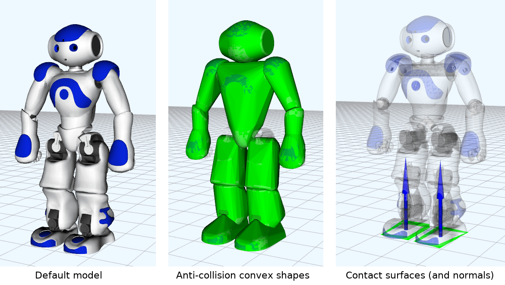

# NAO robot description for [`mc_rtc`](https://jrl-umi3218.github.io/mc_rtc/)

This repository contains NAO robot description ROS package customized for [`mc_nao`](https://github.com/jrl-umi3218/mc_nao) robot module used by [`mc_rtc`](https://jrl-umi3218.github.io/mc_rtc/) control framework.

The description package includes
* Robot kinematics and dynamics parameters defined in robot [URDF file](urdf/nao.urdf)
* Anti-collision [convex shapes](convex). To visualize them, refer to [mc_convex_visualization](https://jrl-umi3218.github.io/mc_rtc/tutorials/tools/mc_convex_visualization.html).
* Contact surfaces (and normals) defined in [RSDF files](rsdf). To visualize them, refer to  [mc_surfaces_visualization](https://jrl-umi3218.github.io/mc_rtc/tutorials/tools/mc_surfaces_visualization.html).

